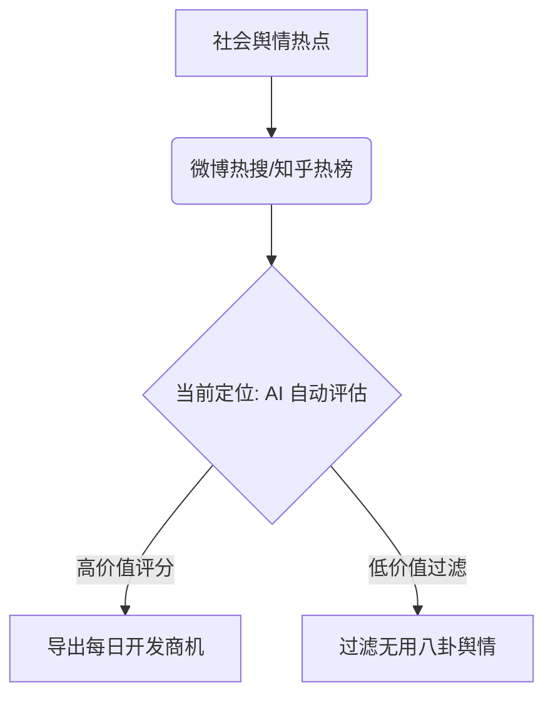

# 📊 Hot News Needs Miner (舆情热点需求捕手) 项目全面评估报告

针对当前项目进行多维度的系统性评估，我们从**产品定位**、**产品设计**、**功能体验**、**项目架构**与**可用性**五个核心维度进行了拆解，并提炼了切实可行的优化与拓展建议。

---

## 1. 产品定位 (Product Positioning)



### 现存状态
当前定位为**“舆情热点需求捕手”**，旨在将普通社会新闻、科技探讨等热点，通过大语言模型（LLM）抽象并转化为软件产品、SaaS 接口或轻量级小程序的商业契机。这对于独立开发者（Indie Hackers）寻找方向非常有帮助。

### 拓展建议
*   **🎯 垂直化分类过滤**：热点数据中娱乐八卦、社会新闻等“无开发价值”内容占比超 80%。虽然当前有 `status='low_value'` 过滤，但建议在分析阶段加入 **“行业/领域分类标签”**（如：自媒体、效率工具、AI、电商、职场、教育等），允许用户按自己感兴趣的赛道筛选需求。
*   **🔍 竞品及市面已有产品探测**：在 LLM 分析 Prompt 中增加一个维度：“市场上是否已存在类似产品？如果有，目前有什么痛点未解决？”。这能使定位从“空想构想”升级为“差异化商机发现”。

---

## 2. 产品设计 (Product Design)

### 现存状态
*   **视觉效果卓越**：前端采用苹果暗黑风格设计（Glassmorphic），带有微妙的紫/蓝/红渐变发光，字体使用了非系统默认的 `Outfit`，整体观感十分高档且专业。
*   **结构清晰**：侧边栏过滤器与主卡片网格响应式布局清晰。

### 优化建议
*   **📈 可视化仪表盘 (Analytics Dashboard)**：当前界面完全由卡片平铺。建议在顶部或侧边增加一个统计折线图/环形图，展示：“今日高价值需求占比”、“高频词云/痛点聚合”、“开发难度分布”。
*   **🖨️ 多样化日报分享**：目前只能下载 Markdown。建议支持：
    *   **一键复制 HTML/Rich Text**（方便直接粘贴到微信公众号、知识星球等平台）。
    *   **生成精美的海报图**（便于在朋友圈/社群分享传播）。

---

## 3. 功能使用体验 (User Experience)

### 现存状态
支持单条分析、批量分析（带进度条悬浮窗提示）、RSS 降级通知与日报 Markdown 预览导出，操作流程基本完整。

### 优化建议
*   **⏰ 引入定时自动爬取与分析**：目前需要手动点击“刷新抓取”。建议引入定时任务（如 Fast Cron 或 Background Task），在每天清晨 6 点自动爬取并对前 10 条高热度事件进行 AI 分析，让用户“开箱即用”。
*   **🔄 重新分析机制 (Re-analyze)**：卡片进入已分析/低价值状态后，就没有了操作按钮。应在详情弹窗或卡片右上角保留一个“重新分析”的按钮。如果配置的 LLM 模型升级或修改了 Prompt，用户可以对关心的事件重试。
*   **💀 动态骨架屏 (Skeleton Loading)**：点击“AI 分析”时，卡片只有按钮显示为加载中，整体卡片内容是空白的。应当把正在分析的卡片渲染为动态波纹骨架屏，提升视觉反馈的细腻度。

---

## 4. 项目设计与架构 (Project Architecture)

### 现存状态
采用 **FastAPI + SQLite + requests + ThreadPoolExecutor** 架构。

### 优化建议
*   **⚡ 异步化改造 (Asyncio & HTTPX)**：目前多线程批量分析使用的是阻塞的 `requests`（且 `max_workers=2` 较小）。在并发调用 LLM API 时，可以使用 Python 的 `asyncio` 配合 `httpx`，这样无需启动多线程即可轻松实现 5-10 路的高并发 API 调用，且系统资源占用极低。
*   **🧱 分布式状态隔离风险**：批量分析状态 `batch_state` 放在内存的全局 dict 中：
    ```python
    batch_state = { "running": False, "total": 0, ... }
    ```
    如果生产环境使用多 Worker 启动服务（如 `uvicorn main:app --workers 4`），请求分发到不同进程会导致全局状态不一致。应该将批量状态持久化至 SQLite 数据库中。
*   **🛡️ 爬虫代理与健壮性**：`crawler.py` 对微博的 Cookie 手动处理机制较为脆弱，虽然有公共 RSSHub 容灾，但容易遇到 Rate limit。建议支持外部代理池配置。

---

## 5. 可用性 (Usability)

### 现存状态
*   **容灾设计好**：抓取失败时有 RSSHub 降级，LLM 失败时有 Fallback 容灾与 Circuit-breaker 熔断机制，具备生产级别的高可用思考。

### 优化建议
*   **🏁 Demo 演示模式**：对于没有 GEMINI API Key 快速体验的用户，应该在检测到未配置 Key 时，自动启用 Mock 分析数据（加载预置的优质分析案例），让用户先体验系统的需求筛选、日报生成和卡片筛选功能，降低体验门槛。
*   **📝 API 错误具体化**：当 API 抛出 401 认证失败、429 超限等错误时，界面应该给出具体指导（如：“API Key 无效，请检查权限”），而不是目前通用的 “API调用异常”。

---

# 🚀 推荐优化方案实施优先级

```
[高优先级 P0] 
  ├── 异步化改造: 用 httpx & asyncio 替换 ThreadPoolExecutor，解决并发 API 阻塞问题
  ├── 重新分析机制: 允许在卡片上直接“重新分析”
  └── Demo 演示模式: 无 API key 时载入 mock 案例卡片，提高项目开箱即用性

[中优先级 P1]
  ├── 定时自动抓取: 增加后台 scheduler 自动拉取
  ├── 行业标签分类: 对热点生成领域标签（如“效率工具”，“AI应用”）
  └── 批量状态持久化: 将内存 batch_state 改为 SQLite 存储，防止多进程状态冲突

[低优先级 P2]
  ├── 数据分析面板: 增加 Chart.js 图表，展示高价值热点趋势
  └── 日报导出优化: 增加复制富文本 / 一键分享按钮
```
